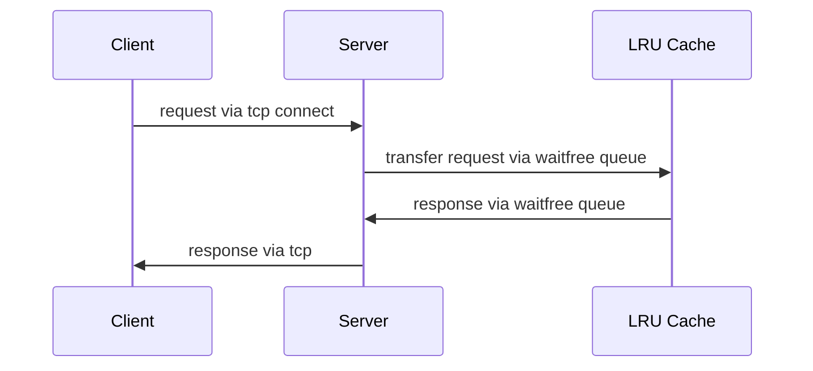

# LRU Cache Server

This repository contains lru cache server written for fun.

## Availible operations
1. get(G) key
2. put(P) key value
3. delete(D) key

## Architecture

Server and LRU Cache running on 2 separate threads and communicates with waitfree queue:

